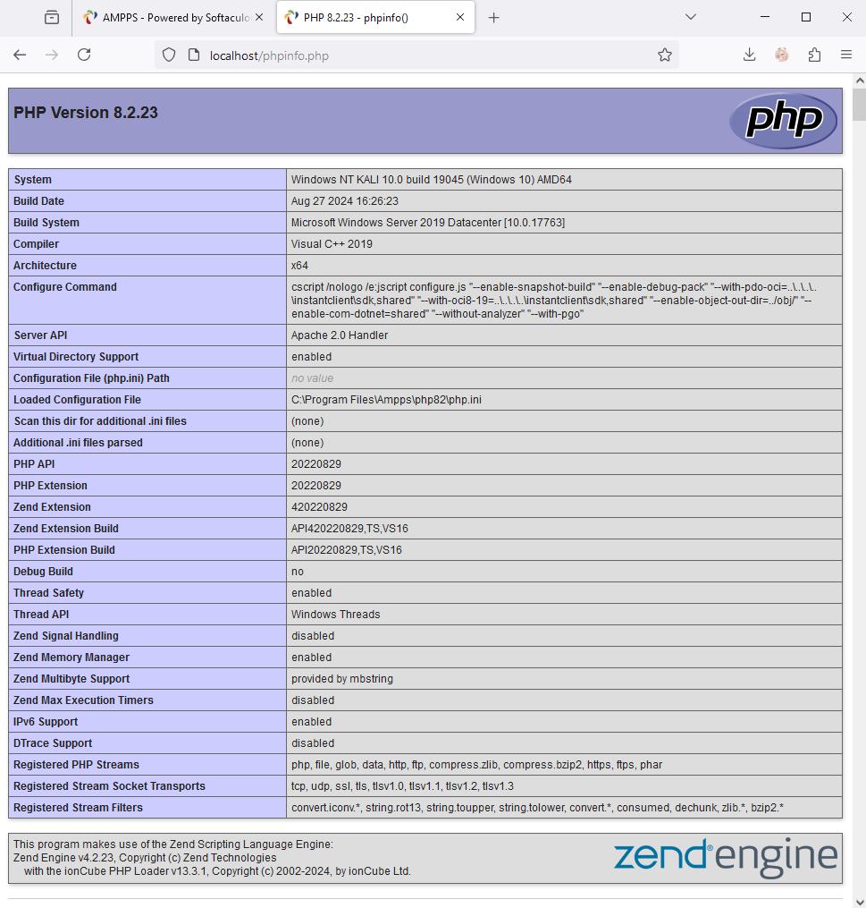
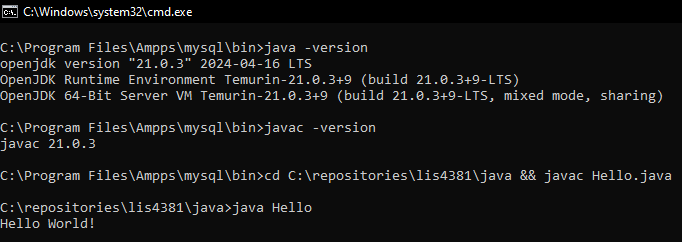
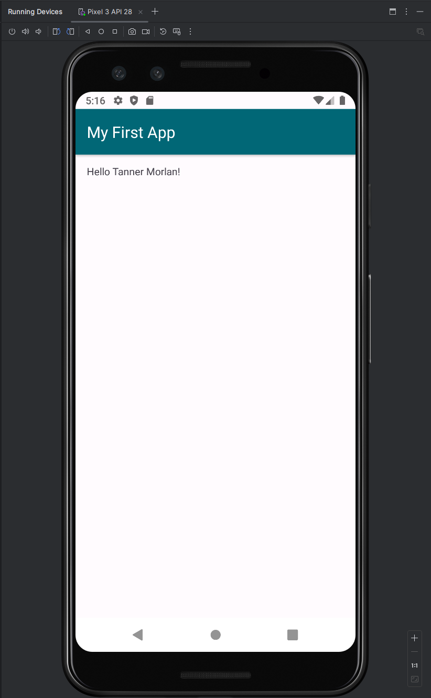

> **NOTE:** This README.md file should be placed at the **root of each of your repos directories.**
>
>Also, this file **must** use Markdown syntax, and provide project documentation as per below--otherwise, points **will** be deducted.
>

# LIS4381 - Mobile Web Application Development

## Tanner Morlan

### **Assignment 1 Requirements:**

*Three Parts*

1. Distributed Version Control with Git and Bitbucket
2. Development Installations
3. Chapter Questions (CHs 1, 2)

**README.md file should include the following items:**

- Screenshot of AMPPS Installations [my_php_installation.png](img/my_php_installation.png "My PHP Installation")
- Screenshot of running java Hello
- Screenshot of running Android Studio - My First App
- git commands w/short descriptions
- Bitbucket repo links: a) this assignment and b) the completed tutorials above (butbucketstationlocations and myteamquotes)

> This is a blockquote.
> 
> This is the second paragraph in the blockquote.
>
> #### Git commands w/short descriptions:

1. git init: Create an empty Git repository or reinitialize an existing one
2. git status: Show the working tree status
3. git add: Add file contents to the index
4. git commit: Record changes to the repository
5. git push: Update remote refs along with associated objects
6. git pull: Fetch from and integrate with another repository or a local branch
7. One addition git command - git clone: Clone a repository into a new directory

#### **Assignment Screenshots:**

#### *Screenshot of AMPPS running [my_php_installation.png](img/my_php_installation.png "My PHP Installation")*

#### *Screenshot of java Hello*

#### *Screenshot of Android Studio - My First App*

