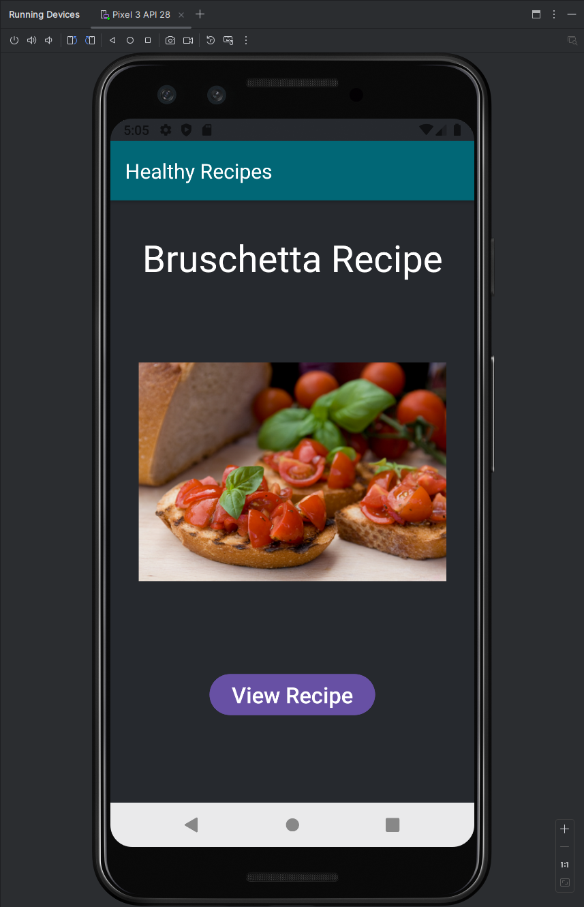
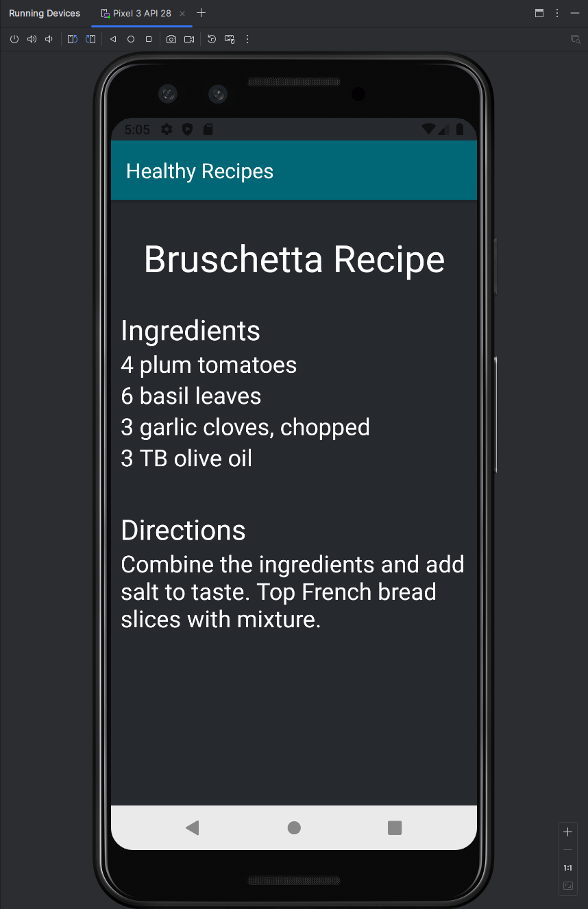
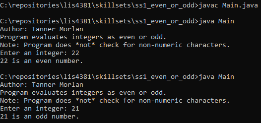
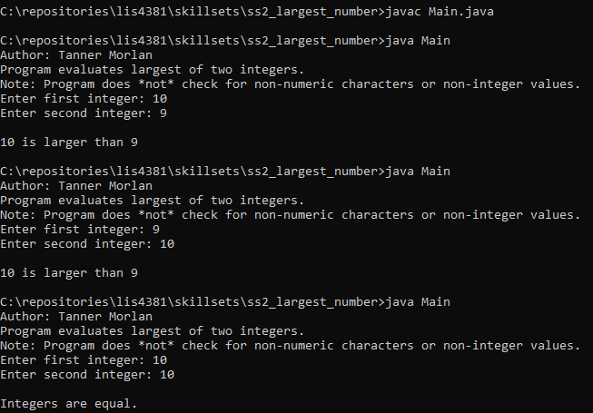
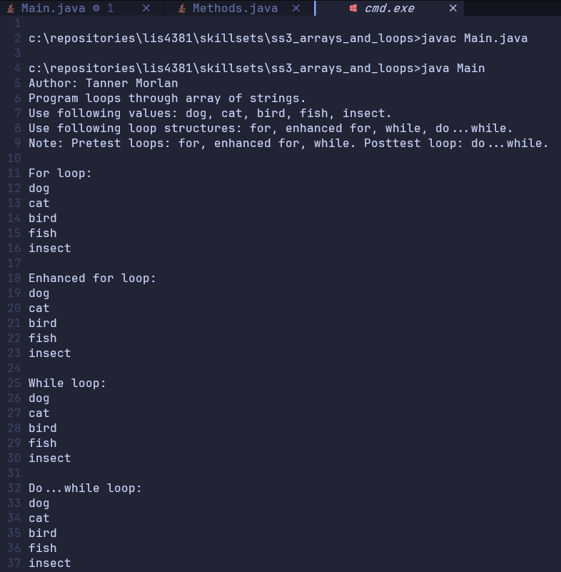

> **NOTE:** This README.md file should be placed at the **root of each of your repos directories.**
>
>Also, this file **must** use Markdown syntax, and provide project documentation as per below--otherwise, points **will** be deducted.
>

# LIS4381 - Mobile Web Application Development

## Tanner Morlan

### **Assignment 2 Requirements:**

*Three Parts*

1. Screenshot of Working App With Both Interfaces
2. Change Background Colors of app, button, and toolbar.
3. Add background border to image.
4. Add favicon in toolbar.
5. Skill Sets
6. Chapter Questions (CHs 3, 4)

**README.md file should include the following items:**

- Screenshot of Working App With Both Interfaces
- Working App Showing Changed Background Color and Text Color
- Screenshots of Skill Sets

> This is a blockquote.
> 
> This is the second paragraph in the blockquote.
>

#### *Screenshot of Working App - First Interface*

#### *Screenshot of Working App - Second Interface*

#### *Screenshot of Skill Set 1*

#### *Screenshot of Skill Set 2*

#### *Screenshot of Skill Set 3*

