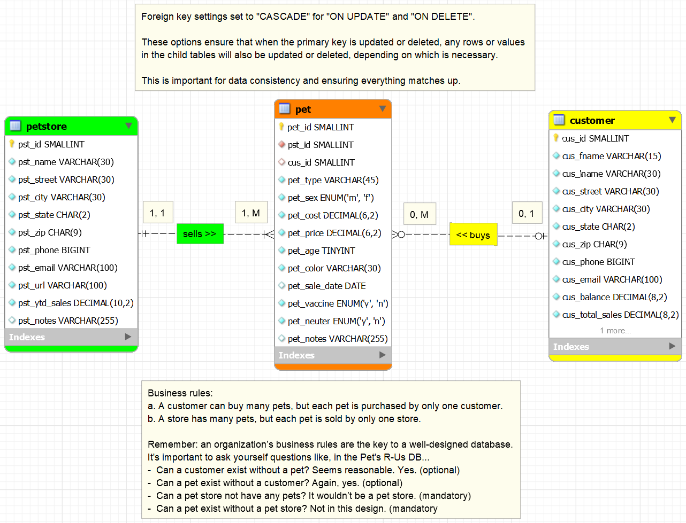
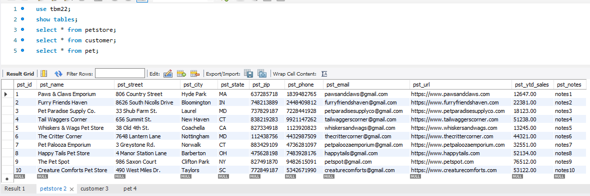
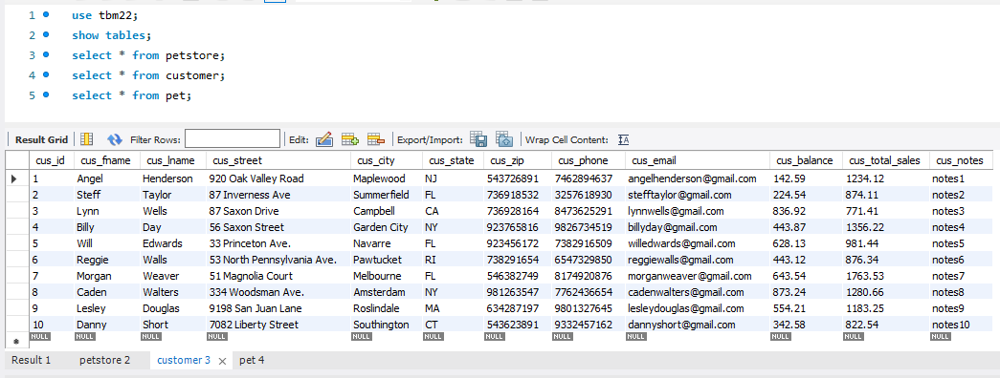
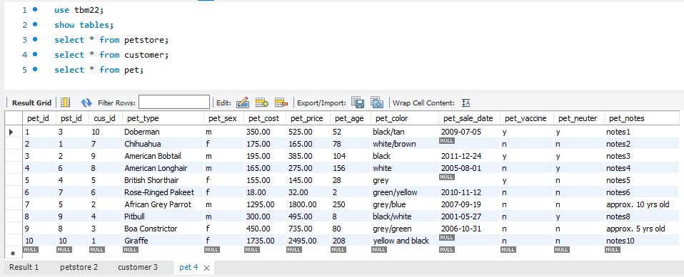
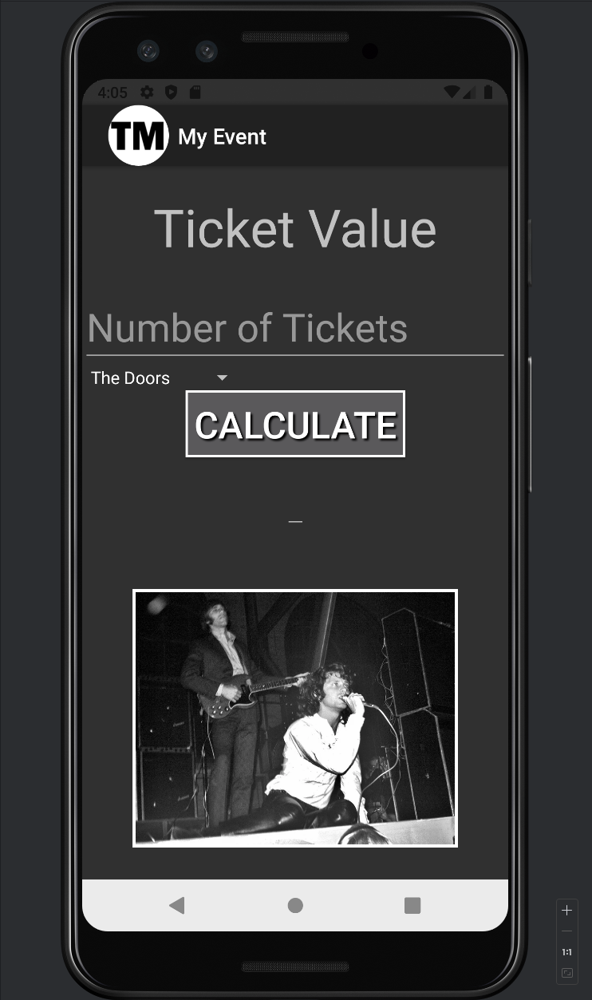
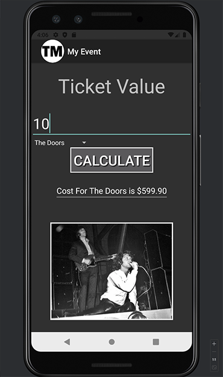

> **NOTE:** This README.md file should be placed at the **root of each of your repos directories.**
>
>Also, this file **must** use Markdown syntax, and provide project documentation as per below--otherwise, points **will** be deducted.
>

# LIS4381 - Mobile Web Application Development

## Tanner Morlan

### **Assignment 3 Requirements:**

*Six Parts*

1. Create ERD based on business requirements
2. Populate tables with data
3. Forward engineer ERD and save as SQL file
4. Create app that calculates total cost for concert tickets
5. Skill sets
6. Chapter Questions (CHs 5, 6)

**README.md file should include the following items:**

- Screenshot of ERD
- Screenshot of running application's opening user interface
- Screenshot of running application's processing user input
- Screenshots of 10 records for each table
- Links to the following files: a3.mwb & a3.sql
- Screenshots of skill sets

> This is a blockquote.
> 
> This is the second paragraph in the blockquote.
>

### **Assignment Links**

*A3 docs: a3.mwb and a3.sql:* 

[a3.mwb](docs/a3.mwb) 

[a3.sql](docs/a3.sql)

### **Assignment Screenshots**

| *Screenshot of ERD* | *Screenshots of table 1* |
| ------------- | ------------- |
|  |  |
|  |  |

| *Screenshot of running application's opening user interface* | *Screenshot of running application's processing user input* |
| ------------- | ------------- |
|  |  |
