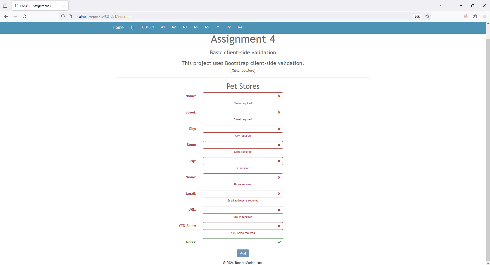
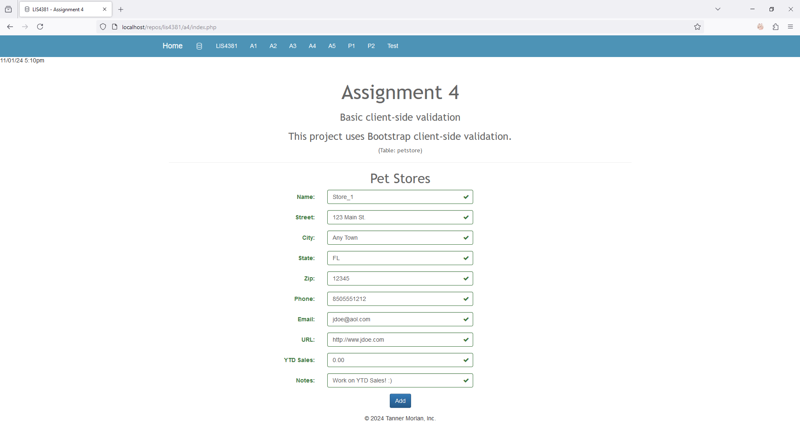
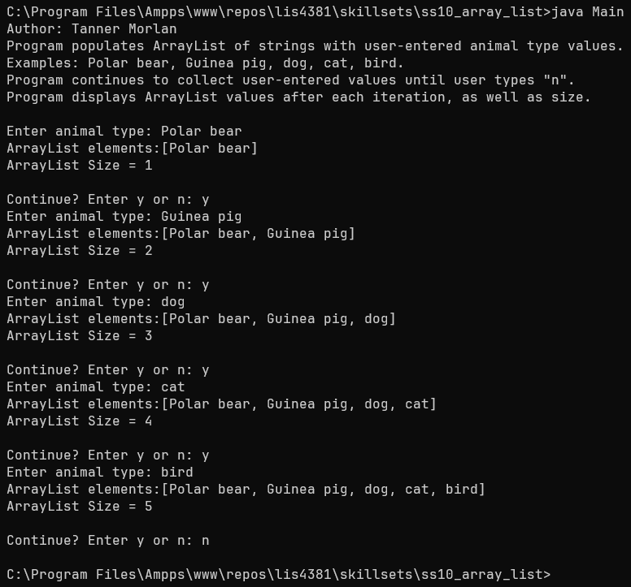
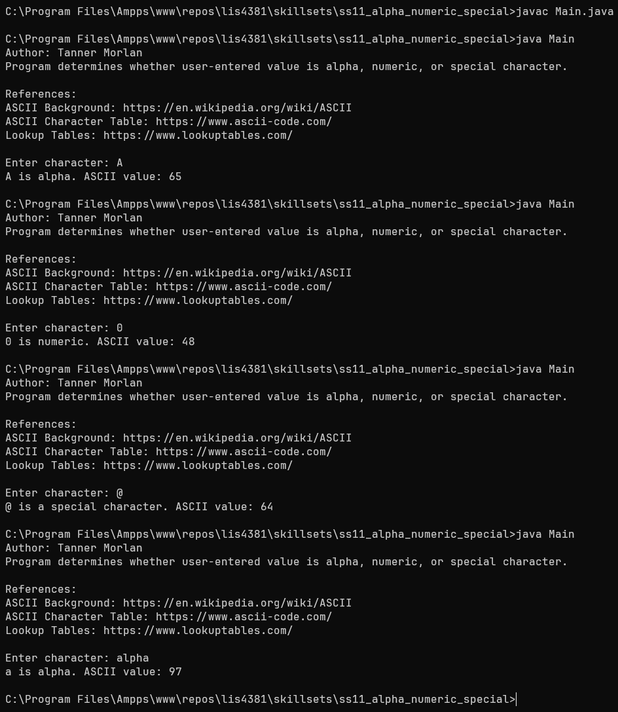
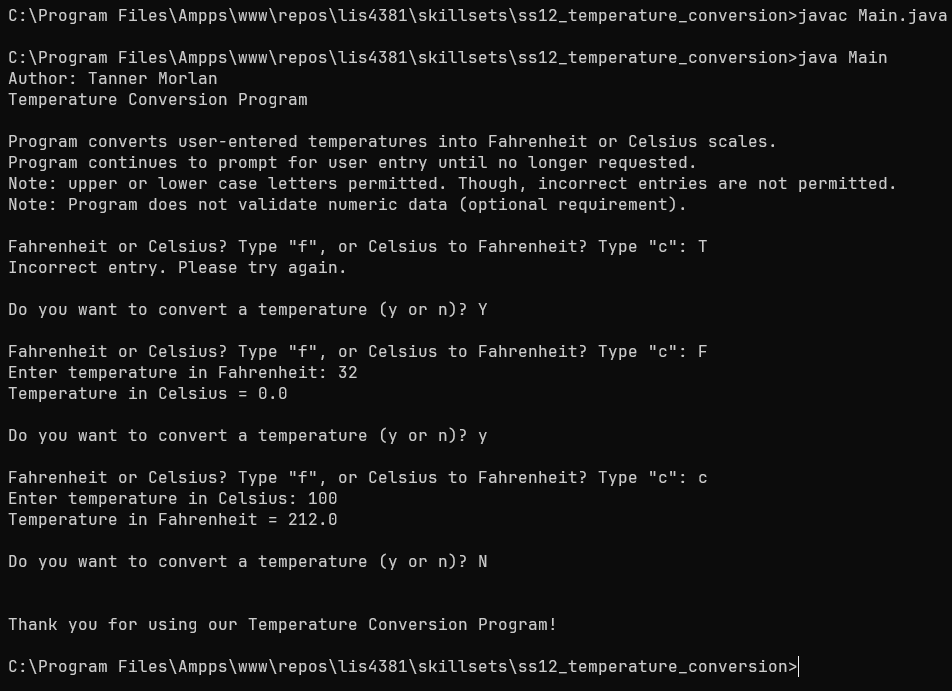

> **NOTE:** This README.md file should be placed at the **root of each of your repos directories.**
>
>Also, this file **must** use Markdown syntax, and provide project documentation as per below--otherwise, points **will** be deducted.
>

# LIS4381 - Mobile Web Application Development

## Tanner Morlan

### **Assignment 4 Requirements:**

*Five Parts*

1. Use regexp to only allow appropriate characters for each control
2. Show failed validation
3. Show passed validation
4. Redesign pages by including new images, new colors, and formatting.
5. Research what the following validation code does:
```
valid: 'fa fa-check' - When the form is valid, there will be a check mark displayed from the font awesome library.
invalid: 'fa fa-times' - When the form is invalid, there will be an "X" icon displayed from the font awesome library.
validating: 'fa fa-refresh' - When the form is validating, a refresh icon will display from the font awesome library.
```

**README.md file should include the following items:**

- Screenshot of LIS4381 Portal (Main Page)
- Screenshot of Failed Validation
- Screenshot of Passed Validation
- Screenshots of Skill Sets

> This is a blockquote.
> 
> This is the second paragraph in the blockquote.
>

### **Assignment Screenshots**

*Screenshot of LIS4381 Portal (Main Page)*
")

| *Screenshot of Failed Validation* | *Screenshot of Passed Validation* |
| ------------- | ------------- |
|  |  |

### **Skill Set Screenshots**

| *Code for [Skill Set 10](../skillsets/ss10_array_list/Methods.java)* | *Code for [Skill Set 11](../skillsets/ss11_alpha_numeric_special/Methods.java)* |
| ------------- | ------------- |
|  |  | 


| *Code for [Skill Set 12](../skillsets/ss12_temperature_conversion/Methods.java)* |
| ------------- |
|  |