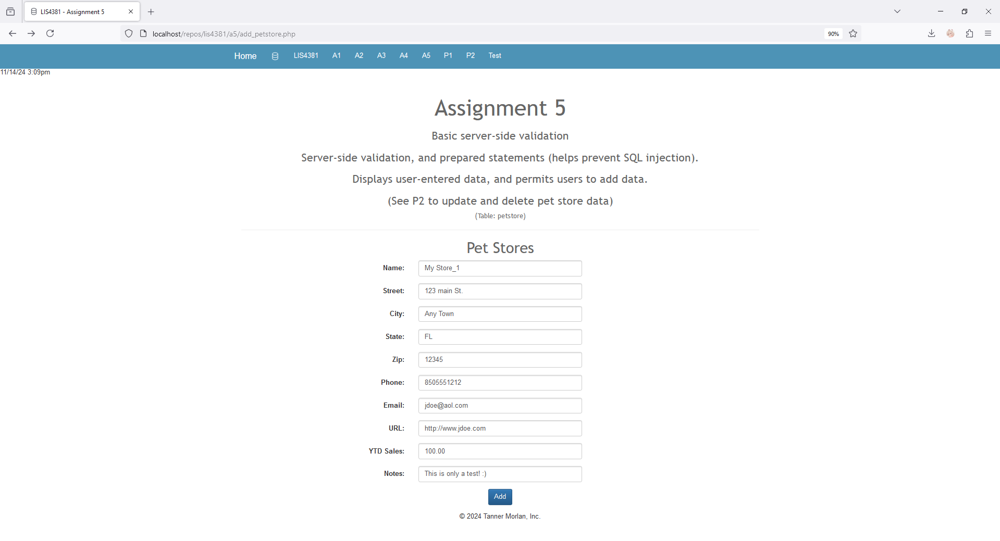
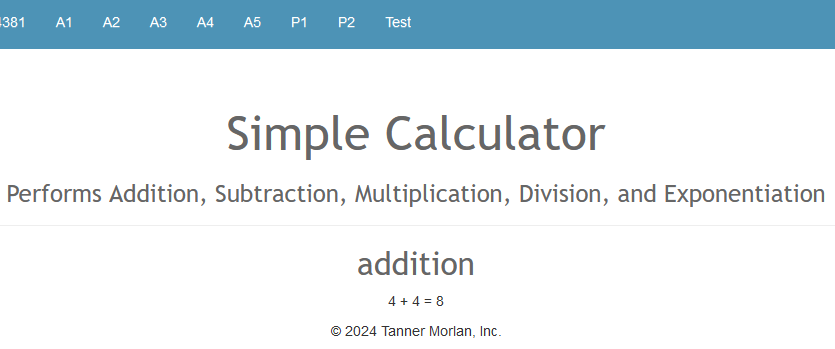

> **NOTE:** This README.md file should be placed at the **root of each of your repos directories.**
>
>Also, this file **must** use Markdown syntax, and provide project documentation as per below--otherwise, points **will** be deducted.
>

# LIS4381 - Mobile Web Application Development

## Tanner Morlan

### **Assignment 5 Requirements:**

*Five Parts*

1. Use server-side validation to ensure data being entered is correct. Use regular expressions.
2. Show failed validation
3. Show passed validation
4. Once validation is tested, use HTML to limit the number of characters for each control.
5. Create php calculator program, and program to write and read from the same file.

**README.md file should include the following items:**

- Screenshot of Assignment 5 main page showing the data from the database
- Screenshot of invalid data on the add petstore page.
- Screenshot of the invalid data after processing.
- Screenshot of valid data on the add petstore page.
- Screenshot of the valid data after processing.
- Screenshot of skill sets.

> This is a blockquote.
> 
> This is the second paragraph in the blockquote.
>

### **Assignment Screenshots**

*Screenshot of Assignment 5 main page showing the data from the database*

| *Screenshot of invalid data on the add petstore page* | *Screenshot of the invalid data after processing* |
| ------------- | ------------- |
|  |  |

| *Screenshot of valid data on the add petstore page* | *Screenshot of the valid data after processing* |
| ------------- | ------------- |
|  |  |

### **Skill Set Screenshots**

*Code for [Skill Set 13](../skillsets/ss13_sphere_volume_calculator/Methods.java)* 

 

*Code for Skill Set 14: [index.php](../simple_calculator/index.php) and [process_functions.php](../simple_calculator/process_functions.php)*

| *Screenshot of Calculator (Addition)* | *Screenshot of Addition Function Process* |
| ------------- | ------------- |
| ") |  |
| *Screenshot of Calculator (Division)* | *Screenshot of Division Function Process* |
| ------------- | ------------- |
| ") |  |

*Code for Skill Set 15: [index.php](../write_read_file/index.php) and [process.php](../write_read_file/process.php)*

| *Screenshot of Write/Read Index* | *Screenshot of Write/Read File Process* |
| ------------- | ------------- |
|  |  |