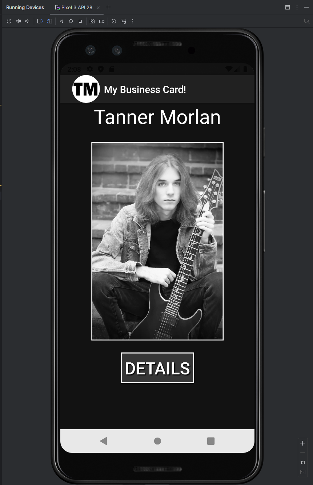
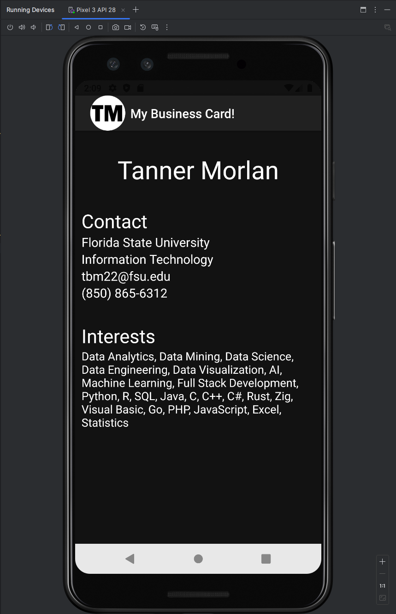
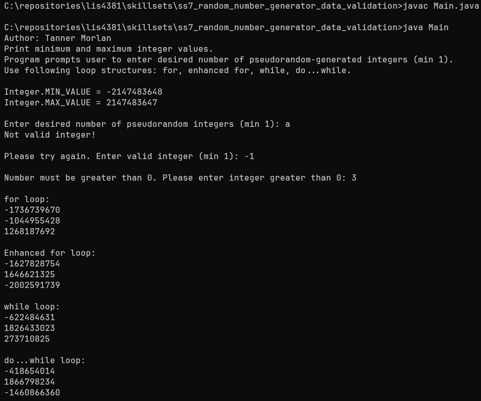
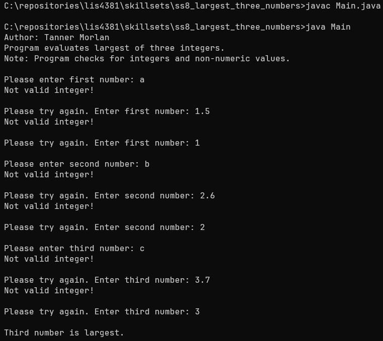
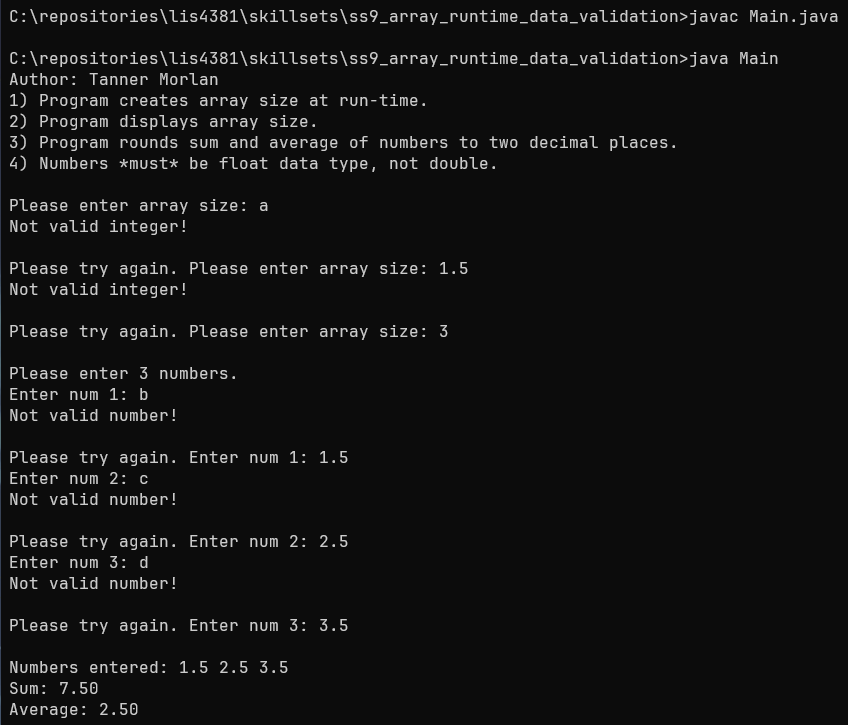

> **NOTE:** This README.md file should be placed at the **root of each of your repos directories.**
>
>Also, this file **must** use Markdown syntax, and provide project documentation as per below--otherwise, points **will** be deducted.
>

# LIS4381 - Mobile Web Application Development

## Tanner Morlan

### **Project 1 Requirements:**

*Five Parts*

1. Create business card app for myself
2. Apply concepts learned from previous assignments to facilitate progress
3. Include image, name, contact, and interests
4. Use launcher icon and display it in both activities
5. Ensure background color, image/button border, and text shadow were all functional

**README.md file should include the following items:**

- Screenshot of running application's opening user interface
- Screenshot of running application's details page
- Screenshots of skill sets

> This is a blockquote.
> 
> This is the second paragraph in the blockquote.
>

### **Assignment Screenshots**

| *Screenshot of running application's opening user interface* | *Screenshot of running application's details page* |
| ------------- | ------------- |
|  |  |

### **Skill Set Screenshots**

| *Code for [Skill Set 7](../skillsets/ss7_random_number_generator_data_validation/Methods.java)* | *Code for [Skill Set 8](../skillsets/ss8_largest_three_numbers/Methods.java)* |
| ------------- | ------------- |
|  |  | 

| *Code for [Skill Set 9](../skillsets/ss9_array_runtime_data_validation/Methods.java)* |
| ------------- |
|  |