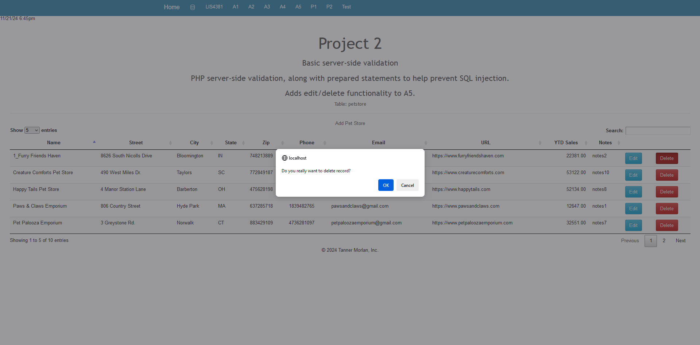

> **NOTE:** This README.md file should be placed at the **root of each of your repos directories.**
>
>Also, this file **must** use Markdown syntax, and provide project documentation as per below--otherwise, points **will** be deducted.
>

# LIS4381 - Mobile Web Application Development

## Tanner Morlan

### **Project 2 Requirements:**

*Five Parts*

1. Build upon A5
2. Maintain previous server-side validation
3. Use prepared statements to help prevent SQL injection
4. Add edit functionality
5. Add ability to delete records

**README.md file should include the following items:**

- Screenshot of Main Page
- Screenshot of Project 2 Index
- Screenshot of Edit Petstore & New Entry
- Screenshot of Failed Validation
- Screenshot of Passed Validation
- Screenshot of Delete Record Prompt
- Screenshot of Successful Record Deletion
- Screenshot of RSS Feed

> This is a blockquote.
> 
> This is the second paragraph in the blockquote.
>

### **Assignment Screenshots**

*Screenshot of Main Page*

*Screenshot of Project 2 Index*

| *Screenshot of Edit Petstore & New Entry* | *Screenshot of Failed Validation* |
| ------------- | ------------- |
|  |  |

*Screenshot of Passed Validation*

*Screenshot of Delete Record Prompt*

*Screenshot of Successful Record Deletion*

*Screenshot of RSS Feed*
